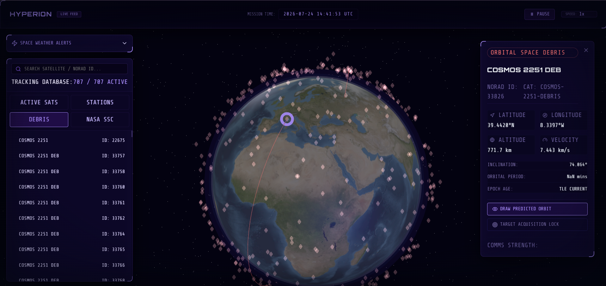

# 🛰️ HYPERION: Real-Time Space Debris & Satellite Tracker

A high-performance, dark "mission control" style 3D WebGL application designed to track, visualize, and simulate satellites, space stations, and hazardous orbital space debris in real-time across the globe.

Built using **React 19**, **TypeScript**, **Three.js**, and **satellite.js** on the frontend, backed by a **Node.js / Express proxy server** with intelligent multi-tiered caching.

---

## 📸 Interface & Preview Showcase


*Figure 1: HYPERION 3D WebGL Globe & Space Station Target Acquisition.*


*Figure 2: Active Satellites Catalog & Orbit Trajectory Lines.*


*Figure 3: Hazardous Orbital Debris Collision Field Tracking.*


*Figure 4: NASA SSC Deep-Space Observatory Trajectory Feeds.*

---

## 🚀 Key Features

1. **3D WebGL Holographic Globe:**
   - Interactive 3D Earth rendering with custom shader textures, stardust background field, and holographic coordinate grids.
   - Smooth rendering loop handling thousands of active orbits at 60 FPS.
   - Visual distinction for Active Satellites, Space Stations, Space Debris fields, and NASA Science Missions.

2. **Real-Time SGP4 Orbital Propagation:**
   - Client-side SGP4/SDP4 Keplerian orbital propagation utilizing `satellite.js` directly from live NORAD / CelesTrak Two-Line Element (TLE) datasets.
   - Live UTC Mission Clock, play/pause controls, and adjustable simulation speed multipliers (1x, 5x, 10x, 60x, up to 600x).

3. **NASA Data Integration & Space Weather Monitoring:**
   - **NASA DONKI API:** Streams live space weather alerts, Coronal Mass Ejections (CMEs), Solar Flares, and Geomagnetic Storm (G1–G5) logs directly into the HUD sidebar.
   - **NASA SSC API:** Queries deep-space observatory catalogs (HST, JWST, SOHO, ACE, ISS) and maps precise 3D trajectory arrays into geodetic latitude, longitude, and altitude coordinates.

4. **Interactive Mission Control HUD:**
   - **Target Acquisition Lock:** Smoothly centers and tracks selected objects as they travel through orbit.
   - **Predictive Trajectory Lines:** Renders 3D orbital ellipses with a single click.
   - **Database Catalog & Search:** Instant search filter across thousands of spacecraft by name or NORAD catalog ID.

---

## 🛠️ How I Made It (Technical Architecture)

### 1. High-Performance WebGL Graphics (Three.js)
Rendering thousands of individual 3D meshes in a browser normally causes severe draw-call performance lag. To achieve 60 FPS:
* **Single Buffer `THREE.Points` Allocation:** All satellite coordinates are packed into a flat `Float32Array` attribute buffer managed within a single WebGL draw call.
* **Custom Hologram Texture Factories:** Dynamic HTML5 canvas textures create glowing HUD target reticles for space stations, active satellites, debris fragments, and NASA observatories.

### 2. Client-Side SGP4 Orbital Physics (`satellite.js`)
Instead of overwhelming the server by calculating coordinate steps for 5,000 objects every frame:
* Raw TLE data lines (Line 1 & Line 2 containing inclination, eccentricity, mean anomaly, and motion) are sent to the frontend.
* `satellite.js` runs SGP4 orbital mechanics algorithms on the client GPU/CPU loop, converting Earth-Centered Inertial (ECI) coordinates to Geodetic latitude, longitude, and altitude relative to the live UTC timestamp.

### 3. Node.js / Express Proxy & Caching Layer
* **Multi-Tiered Caching (`node-cache` + Disk Backup):** CelesTrak and NASA APIs impose rate limits. The Express proxy caches TLE payloads in-memory for 2 hours (`stdTTL: 7200`) and writes disk backups to disk so the application continues to run seamlessly even offline or when rate-limited.
* **NASA XML-JSON Payload Parsing:** Abstracts complex Java-serialized response schemas from NASA SSCWeb into clean geodetic coordinate points (`{ time, lat, lon, alt, x, y, z }`).

---

## 💻 Tech Stack

- **Frontend:** React 19, TypeScript, Three.js, Lucide Icons, Vite, Tailwind CSS
- **Physics Engine:** `satellite.js` (SGP4/SDP4 Keplerian orbital propagation)
- **Backend:** Node.js, Express, Axios, Node-Cache
- **Data APIs:** CelesTrak / NORAD GP, NASA DONKI, NASA SSCWeb

---

## 📁 Directory Structure

```
Space debris tracker/
├── server/                 # Express backend proxy server
│   ├── index.js            # Express API routing & caching layer
│   ├── package.json        # Backend dependencies
│   └── .env                # NASA API Key & Port configuration
├── client/                 # React frontend web app
│   ├── src/
│   │   ├── components/
│   │   │   ├── Globe.tsx       # Three.js WebGL globe & particle system
│   │   │   ├── Sidebar.tsx     # HUD navigation & Space Weather alerts
│   │   │   └── DetailPanel.tsx # Target telemetry & camera lock controls
│   │   ├── services/
│   │   │   └── api.ts          # Express proxy API client
│   │   ├── App.tsx             # Main application state & loop controller
│   │   └── main.tsx            # React entry mount
│   ├── index.html          # Web page layout
│   └── package.json        # Frontend dependencies
├── docs/                   # Screenshots & media assets
└── README.md               # Documentation
```

---

## ⚡ Setup & Running Instructions

### 1. Prerequisites
Ensure you have [Node.js](https://nodejs.org/) (v18+ recommended) installed on your system.

### 2. Backend Server Setup
1. Open terminal and navigate to `server/`:
   ```bash
   cd server
   ```
2. Install backend dependencies:
   ```bash
   npm install
   ```
3. *(Optional)* Add your NASA API Key in `server/.env`:
   ```env
   PORT=3001
   NASA_API_KEY=YOUR_FREE_NASA_API_KEY
   ```
   *(If omitted, defaults to DEMO_KEY with built-in automatic fallbacks).*
4. Start backend server:
   ```bash
   npm run dev
   ```
   *Backend proxy will run at `http://localhost:3001`.*

### 3. Frontend Client Setup
1. Open a **new terminal window** and navigate to `client/`:
   ```bash
   cd client
   ```
2. Install frontend dependencies:
   ```bash
   npm install
   ```
3. Start frontend dev server:
   ```bash
   npm run dev
   ```
4. Open the displayed local URL in your browser (typically `http://localhost:5173`).

---

## ⚖️ You must be wondering, how is this even legal?

Tracking thousands of military satellites, commercial spacecraft, and orbital space debris in real-time sounds like top-secret classified military intelligence—so how is HYPERION legally allowed to stream and display this data?

### The Short Answer:
**Because orbital physics is public science, and space safety requires global transparency.**

### 1. International Space Safety & Public TLE Catalogs
Under international space treaties and US Space Policy, the **US Space Command (18th Space Defense Squadron)** and organizations like **CelesTrak** publicly publish **Two-Line Element (TLE)** orbital data for all cataloged, unclassified space objects. Without open orbital catalogs, commercial satellite operators, space agencies, and private telecom fleets (like SpaceX Starlink) wouldn't be able to calculate collision risks or avoid space collisions!

### 2. Orbital Mechanics is Pure Math
Once a satellite is launched into orbit, its trajectory obeys **Kepler’s Laws of Planetary Motion** and **Newtonian Gravity**. A TLE dataset provides the basic orbital elements (inclination, speed, altitude, eccentricity). Anyone running the standardized **SGP4 (Simplified General Perturbations)** physics math formula can predict the exact position of a satellite down to the second anywhere on Earth!

### 3. Open NASA APIs
NASA explicitly encourages open-source scientific software development by providing free, public REST APIs for **DONKI (Space Weather Database)** and **SSCWeb (Satellite Situation Center)**. HYPERION uses these public endpoints strictly for educational, scientific, and visualization purposes.
